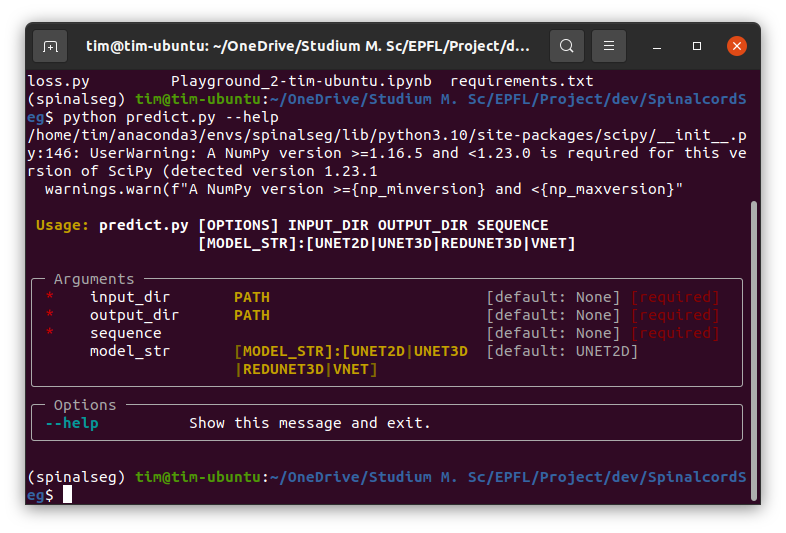

# Exploring Automatic Spinal Cord Segmentation Using Deep Learning
The project was conducted at the [Medical Image Processing Lab](https://miplab.epfl.ch/) in Geneva and is part of an
optional semester project at EPFL. It aims at creating a usable pipeline for automatic spinal cord segmentation for fMRI
images by creating deep learning models in a supervised learning paradigm. The datasets used in this project are
provided by the MIP Lab and can be characterized as follows:
- dataset of 47 subjects, each containing a mean fMRI image created from 7 timepoints and the corresponding mask
- dataset of 20 subjects, each containing the whole fMRI sequence of 360 timepoints and a mask of the mean image
- dataset of 15 subjects, each containing a mean fMRI image of the lumbar spine and the corresponding mask

This project uses the second dataset for the training of models and continues a last semesters project which used
the first dataset for training a 2D U-Net created with the 
[segmentation models library](https://github.com/qubvel/segmentation_models.pytorch).

The repository provides the recreated model from last semester and new model architectures embedded in two main
pipelines which are run by `train.py` and `predict.py`. It also provides a structure which facilitates
the creation of new models.
***
## First steps
It is recommended to create a conda environment to run the applications on.

Install packages from provided requirements.txt:
```
pip install -r requirements.txt
```
Install other dependencies:
- [segmentation models library](https://github.com/qubvel/segmentation_models.pytorch)
***
## Usage
We provide a command line interface (CLI) created with the [typer](https://typer.tiangolo.com/) package to
predict masks from created models. The creation of models requires many different parameters which would decrease
the usability if implemented with typer as well. An IDE like PyCharm to change the parameters to your own will
is recommended.

A configuration file for the models is missing and can facilitate the creation of new models further.
### CLI Prediction
The prediction can be started by calling the python script 'predict.py`. By calling help further information
can be acquired.
```bash
$ conda activate environment
$ cd SpinalcordSeg
$ python predict.py --help 
```


The script requires 4 arguments:
- the input directory
- the output directory
- a boolean whether the files are sequences or images
- the chosen model

The desired prediction can be called as follows:
```bash
# to predict for sequence with 2D U-Net
$ python predict.py INPUT_DIR OUTPUT_DIR True
# to predict for image with 3D U-Net
$ python predict.py INPUT_DIR OUTPUT_DIR False --model_str UNET3D
# to predict for image with V-Net
$ python predict.py INPUT_DIR OUTPUT_DIR False --model_str VNET
```

### Model training adjustments
There are several scripts provided which influence the models training:
- `models.py` contains the defined neural network architectures
- `datset_classes.py` defines how the datasets are processed
- `loss.py` contains the defined loss functions
- `utils.py` contains helper functions for training

The scripts for actually training models are:
- `train.py` creates the model with the given hyperparameters
- `gridsearch.py` enables to get different loss curves and accuracy curves for comparison to find optimal
hyperparameters


The possible parameters to adjust are:
- the chosen model
- the loss function
- the metric(s)
- the learning rate
- the number of epochs
- the batch size
- the optimizer

The current values for loss and chosen metric are printed in the terminal. After the training is finished, the loss
curves and accuracy curves are saved in the output folder like trained model is.
The current script also saves models after each fold and the model with the best performance on the validation set.


***
### Integration of new models
To use newly created models for the creation of masks, define a new model in the class `ModelChoices()` in `predict.py`
and add the option in the if else structure in the `main` function. Adapt the name of the model and the size of the
input respectively.